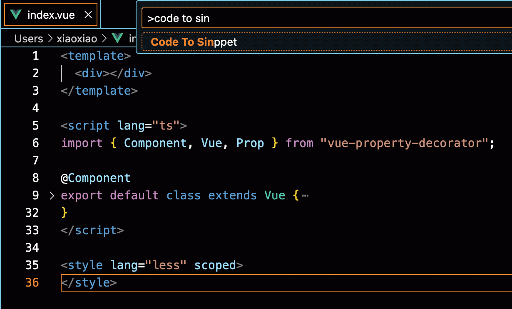
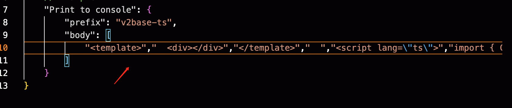

# Dev Assist

This is a assist to help you imporve coding exprience and efficiency that contains a list of commands.

## Features

### parse code to sinppet body

`Shift+Ctrl+V` and input **Code To Sinppet**

### parse sinppet body to code

`Shift+Ctrl+V` and input **Sinppet To Code **

## Known Issues

have no idea now.

## Release Notes

### 0.0.1

Initial release

**Enjoy!**
